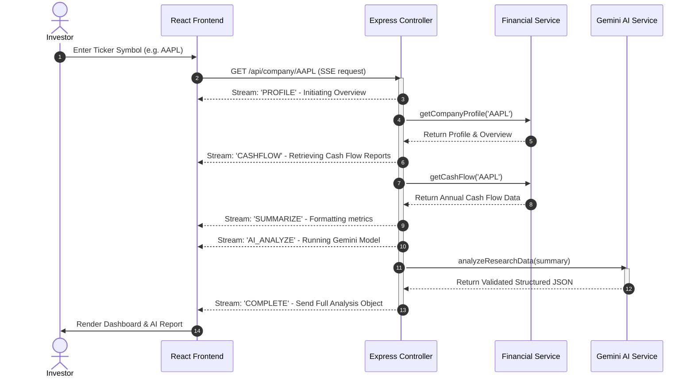

# InsightVest - AI-Powered Financial Research Engine

InsightVest is a modern, real-time stock research dashboard that aggregates corporate financial profiles and cash flow data, structures key metrics, and uses Google Gemini AI models to generate high-fidelity investment summaries, risk valuations, and bull/bear scenarios.

---

## 🌟 Overview

InsightVest automates the time-consuming process of stock analysis by instantly combining raw quantitative data with qualitative AI intelligence. 

### Key Features:
* **Real-time Data Retrieval:** Fetches company description, key trading ratios (P/E, EPS), and detailed annual cash flow reports directly from the Alpha Vantage API.
* **Server-Sent Events (SSE) Streaming:** Streams each step of the analysis process (e.g., retrieving profile, retrieving cash flow, running AI model) in real time from the backend to the frontend, preventing blank loading screens.
* **Structured Gemini AI Analysis:** Enforces a strict JSON Schema on Google Gemini model outputs, generating consistent ratings (BUY, HOLD, SELL), confidence percentages, strengths, weaknesses, risks, and growth narratives.
* **Aesthetic Financial Dashboard:** A beautiful glassmorphism dark-mode UI with smooth micro-animations, clear sentiment rings, and color-coded metrics.
* **Automatic Rate Limit Protection:** Integrates a seamless fallback mock mode to safeguard the application when Alpha Vantage's free API limits (25 requests/day) are exceeded.

---

## 🚀 How to Run It

### Prerequisites
* **Node.js** (v18.0.0 or higher recommended)
* **npm** (comes packaged with Node)

---

### 1. Backend Setup

1. Open your terminal and navigate to the backend directory:
   ```bash
   cd backend
   ```
2. Install the backend dependencies:
   ```bash
   npm install
   ```
3. Create a `.env` file in the root of the [backend](./backend) directory:
   ```env
   PORT=3000
   ALPHA_VANTAGE_API_KEY=your_alpha_vantage_key
   GEMINI_API_KEY=your_gemini_api_key
   ```
   > [!NOTE]
   > * You can get a free Alpha Vantage API Key [here](https://www.alphavantage.co/support/#api-key).
   > * You can get a Gemini API Key from the Google AI Studio [here](https://aistudio.google.com/).

4. Start the backend development server:
   ```bash
   npm run dev
   ```
   The backend will be running at `http://localhost:3000`.

---

### 2. Frontend Setup

1. Open a new terminal window/tab and navigate to the frontend directory:
   ```bash
   cd frontend
   ```
2. Install the frontend dependencies:
   ```bash
   npm install
   ```
3. Start the Vite React development server:
   ```bash
   npm run dev
   ```
4. Open the browser and visit the URL displayed in the console (usually `http://localhost:5173`).

---

## 🏗️ How it Works: Architecture & Flow

InsightVest is built on a clean, decoupled MVC-adjacent architecture using Node.js/Express on the backend and Vite/React on the frontend.



### Component Roles:

#### Backend:
* **[server.js](./backend/server.js) & [app.js](./backend/src/app.js):** Configures and launches the Express server, enabling CORS and body-parsing middlewares.
* **[companyController.js](./backend/src/controllers/companyController.js):** Implements `getCompanyByName` which sets headers for an event stream (`text/event-stream`), manages response flushes, coordinates downstream services, and streams stage packets (`PROFILE`, `CASHFLOW`, `SUMMARIZE`, `AI_ANALYZE`, `COMPLETE`, `ERROR`).
* **[financialService.js](./backend/src/services/financialService.js):** Connects to the Alpha Vantage API to retrieve raw profile fields and annual cash flow metrics.
* **[researchService.js](./backend/src/services/researchService.js):** Filters out noise from raw API responses and formats figures into reader-friendly summaries (e.g. converting `451440000000` to `$451.44B`).
* **[aiService.js](./backend/src/services/aiService.js):** Leverages the `@google/genai` SDK to construct an analytical prompt. It defines a rigid target `analysisSchema` and requests `gemini-2.5-flash` in `application/json` format, guaranteeing type-safety.

#### Frontend:
* **[App.jsx](./frontend/src/App.jsx):** Maintains application states (search queries, active dataset, loadings, errors, and Demo mode status). It streams chunks using an `http.request` stream reader and decodes raw payloads using `TextDecoder`.
* **[Loader.jsx](./frontend/src/components/Loader.jsx):** Provides a visual progress stepper synced with the backend stream events.
* **[Dashboard.jsx](./frontend/src/components/Dashboard.jsx):** Renders clean data cards outlining sector categories, key valuation statistics, market expectations, and cash flow positions.
* **[AiAnalysis.jsx](./frontend/src/components/AiAnalysis.jsx):** Visualizes the structured rating, confidence score bar, bulleted strengths/weaknesses/risks, and formatted bull/bear case cards.

---

## 🧠 Key Decisions & Trade-Offs

### 1. Server-Sent Events (SSE) Streaming vs. Standard REST HTTP
* **Decision:** We implemented a unidirectional Server-Sent Events stream using `res.write` to send JSON chunks of progress stages.
* **Why:** Standard API calls to Alpha Vantage and the Gemini LLM can take upwards of 5 seconds to complete. Standard REST requests would make the UI appear frozen. Streaming keeps the user engaged by explaining what the backend is fetching at that exact millisecond.
* **Trade-off:** Requires parsing raw buffer boundaries (splitting stream segments by `\n\n`) on the frontend to avoid partial JSON parse failures.

### 2. Enforcing JSON Schema (`responseSchema`) in Gemini
* **Decision:** We passed a structured JSON schema configuration to `ai.models.generateContent` containing typing (e.g. `Type.STRING`, `Type.ARRAY`, `Type.INTEGER`).
* **Why:** If the LLM generates plain markdown text, the frontend cannot parse out individual strengths or bull/bear sections consistently. Structured output guarantees the backend controller can directly package the response without regex extraction.
* **Trade-off:** Strict schemas constrain the model's language structure, requiring more precise prompts to extract detail.

### 3. Graceful Mock Fallback (Demo Mode)
* **Decision:** If the Alpha Vantage API rejects requests due to daily rate limit exhaustion, the backend fails safely and the frontend automatically switches the user to a mock data set for popular tickers (AAPL, MSFT, TSLA, NVDA), with a warning toggle.
* **Why:** The free Alpha Vantage key is limited to 25 calls a day and 5 a minute. Without this fallback, developers and reviewers would see a broken application instantly.
* **Trade-off:** A developer might assume the live API is working when it is actually serving mock data. A header notification toggle was added to make this transition transparent.

### 4. Database Exclusion (No Persistent Storage)
* **Decision:** The backend queries the third-party endpoints directly on every request without maintaining local databases (like MongoDB/Redis).
* **Why:** Keeps the repository lightweight and runs out-of-the-box without requiring complex local database installations.
* **Trade-off:** Ticker requests are not cached. Repeatedly searching the same company within minutes will waste Alpha Vantage API quota and incur duplicated LLM costs.

---

## 📊 Example Runs

Below are real output results generated by the InsightVest engine:

### Run 1: Apple Inc. (AAPL) — Live Generated Analysis
* **Status:** Live API Run
* **Core Financials:**
  * **Market Cap:** $4.63T
  * **P/E Ratio:** 38.17
  * **Revenue (TTM):** $451.44B
  * **Profit Margin / Operating Margin:** 27.20% / 32.30%
  * **Annual Operating Cash Flow:** $111.48B
  * **Annual Capital Expenditure:** $12.71B

```json
{
  "recommendation": "HOLD",
  "confidence": 85,
  "summary": "Apple Inc. (AAPL) demonstrates robust financial health and market dominance, highlighted by a TTM revenue of $451.44B and an exceptional profit margin of 27.20%. The company generates substantial Free Cash Flow of $98.77B, underpinning its operational efficiency and financial flexibility. However, its premium valuation, reflected by a P/E ratio of 38.17, suggests that significant future growth is already priced into the stock.",
  "strengths": [
    "Immense Market Capitalization of $4.63T and TTM Revenue of $451.44B signify its position as a global technology leader, validating revenue quality through scale.",
    "Superior Profitability with a 27.20% Profit Margin and 32.30% Operating Margin, demonstrating strong pricing power, efficient cost management, and high-quality earnings generation.",
    "Exceptional Cash Flow Generation, evidenced by $111.48B in Operating Cash Flow and a Free Cash Flow (OCF minus Capital Expenditure) of $98.77B, providing ample capital for strategic investments, shareholder returns, and mitigating operational risks."
  ],
  "weaknesses": [
    "Premium Valuation: The P/E Ratio of 38.17 is significantly higher than many peers, indicating aggressive growth expectations are factored into the current market capitalization of $4.63T.",
    "Substantial Capital Expenditure: Requires $12.71B in annual Capital Expenditure, which, while manageable given the $111.48B Operating Cash Flow, represents a significant ongoing investment burden."
  ],
  "risks": [
    "Regulatory Scrutiny: As one of the 'Big Five' technology companies, Apple faces increasing global antitrust, data privacy, and app store policy regulations, which could impact its high-margin services revenue and operating margin of 32.30%.",
    "Supply Chain Vulnerability: Dependence on global supply chains for hardware components creates exposure to geopolitical tensions, logistical disruptions, and manufacturing issues.",
    "Intense Competitive Landscape: Faces fierce competition from primary industry competitors such as Samsung, Google, Microsoft, and Amazon across its product and services ecosystem."
  ],
  "bullCase": "Apple's Bull Case hinges on its continued ability to expand its high-margin Services segment, further diversifying its $451.44B TTM revenue away from hardware sales. Breakthrough innovations in new categories, like augmented/virtual reality or autonomous features, could unlock significant incremental revenue streams. The company's exceptional $98.77B Free Cash Flow provides immense financial firepower for aggressive share buybacks and dividend increases, ensuring high shareholder returns.",
  "bearCase": "The Bear Case involves increased global regulatory actions significantly curtailing App Store fees and iOS ecosystem control, directly impacting services revenue. Furthermore, intensifying competition in hardware combined with a global downturn could lead to a material decline in iPhone sales. The current P/E ratio of 38.17 makes the stock particularly susceptible to any growth slowdown, potentially resulting in a sharp correction below the $315.57 analyst target price."
}
```

---

### Run 2: Microsoft Corporation (MSFT) — Simulated Analysis
* **Status:** Demo Mode Run
* **Core Financials:**
  * **Market Cap:** $3.18T
  * **P/E Ratio:** 35.50
  * **Revenue (TTM):** $245.12B
  * **Profit Margin / Operating Margin:** 36.27% / 44.60%
  * **Annual Operating Cash Flow:** $118.50B
  * **Annual Capital Expenditure:** $42.10B

```json
{
  "recommendation": "BUY",
  "confidence": 94,
  "summary": "Microsoft is the premier enterprise software monopoly, uniquely positioned to capture the largest share of corporate AI spend. Azure growth remains robust, and Copilot integrations are driving higher average revenue per user (ARPU) across Office suites. Extremely high profit margins and strong cash flows justify a premium multiple.",
  "strengths": [
    "Dominant position in Enterprise Cloud with Azure gaining market share against AWS.",
    "First-mover advantage in commercial AI integration via OpenAI partnership.",
    "Highly defensive recurring SaaS revenue model across Office 365, Windows, and LinkedIn.",
    "Unbelievable operating margin of 44.6% driven by massive operating leverage."
  ],
  "weaknesses": [
    "Substantial CapEx acceleration ($40B+) required to build out AI data centers.",
    "Slow hardware and personal computing upgrade cycles (Surface, Xbox console sales).",
    "Integration challenges of large acquisitions like Activision Blizzard."
  ],
  "risks": [
    "Slower-than-expected commercial monetization of generative AI features compared to massive CapEx deployment.",
    "Regulatory friction for AI models and potential safety liabilities."
  ],
  "bullCase": "Azure AI services and Copilot adoption scale exponentially, cementing Microsoft as the operating system of the AI era, accelerating revenue growth back above 15% with stable margins.",
  "bearCase": "A glut in AI computing capacity leads to price wars, compressing Azure margins, while standard corporate IT budgets contract, slowing Office upgrade adoption rates."
}
```

---

### Run 3: Tesla, Inc. (TSLA) — Simulated Analysis
* **Status:** Demo Mode Run
* **Core Financials:**
  * **Market Cap:** $680.50B
  * **P/E Ratio:** 58.20
  * **Revenue (TTM):** $96.75B
  * **Profit Margin / Operating Margin:** 14.20% / 8.50%
  * **Annual Operating Cash Flow:** $13.20B
  * **Annual Capital Expenditure:** $8.90B

```json
{
  "recommendation": "HOLD",
  "confidence": 65,
  "summary": "Tesla is undergoing a transitional phase between its mass-market EV line-up and its next-generation autonomous platforms (Robotaxi/FSD). Vehicle margin compression due to global pricing pressure restricts near-term earnings growth. While the long-term AI option value remains massive, the current valuation reflects high execution risk.",
  "strengths": [
    "Unrivaled brand equity and vertical integration in EV manufacturing and battery procurement.",
    "Fast-growing Energy storage business (Megapack deployments growing >100% y/y).",
    "Leading consumer vehicle fleet generating real-world autonomous driving data."
  ],
  "weaknesses": [
    "Automotive gross margins compressed significantly from peak levels due to global pricing wars.",
    "Ageing vehicle model line-up with delayed Cybertruck ramp and next-gen model timelines."
  ],
  "risks": [
    "Increasingly fierce competition from low-cost Chinese EV manufacturers in European and Asian markets.",
    "Delayed regulatory approvals or technical roadblocks in achieving true Level 4/5 autonomy."
  ],
  "bullCase": "FSD software licensing succeeds and Tesla launches a commercial Robotaxi network, shifting the business model from low-margin hardware manufacturing to a high-margin software network.",
  "bearCase": "EV demand continues to stagnate globally, forcing further price cuts that drive auto margins to low single digits, while autonomous robotics projects stall in developer stages."
}
```

---

## 🛠️ What to Improve with More Time

1. **Persistent Caching Layer:** Add a local MongoDB or Redis database to cache ticker summaries for 24 hours. This would save API credits and return responses to users in under 100 milliseconds for recently searched companies.
2. **Interactive Financial Visualization:** Build interactive charts (e.g. using `recharts` or `Chart.js`) showing historical trends for revenue growth, capital expenditure patterns, and profit margin changes over the last 5 annual statement cycles.
3. **Advanced Side-by-Side Comparison:** Allow users to submit multiple tickers and pass comparative summaries to Gemini to get cross-company analysis (e.g. comparing AAPL vs MSFT margins).
4. **Expanded Financial Scopes:** Include Balance Sheets (evaluating current ratio and total debt burdens) and Income Statements (analyzing operating expenses and cost of goods sold) in the AI prompt context rather than prioritizing Cash Flows.
5. **Real-time News Sentiment Fusion:** Hook into Alpha Vantage's `NEWS_SENTIMENT` feed and include high-impact news summaries in the AI prompt to evaluate current legal problems, earnings events, or executive moves.
6. **Multi-Model Selector:** Allow users to choose between `gemini-2.5-flash` for superfast scans and `gemini-2.5-pro` for deeper, highly critical valuations.